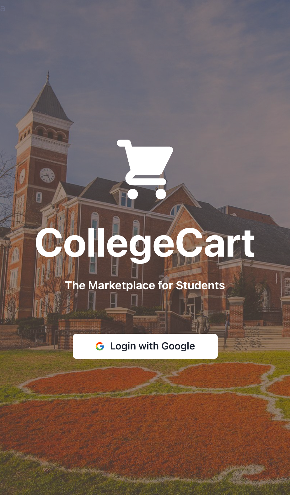
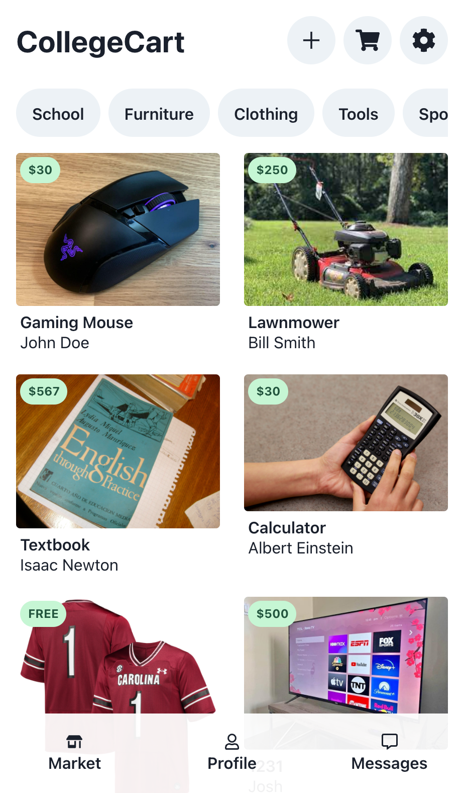
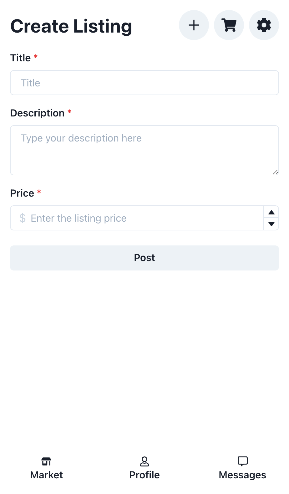

# CollegeCart

A platform to buy and sell stuff from fellow students. Reduces waste and supports community-based commerce while providing a safer avenue for students to buy used goods.

_this is an unfinished prototype made during the CUHackit 2022_

## Inspiration

Hey I'm Charlotte! This project idea began when I wanted to buy a mirror for my college apartment. As a college student, I wanted something inexpensive, and didn't mind buying used. However, as a younger woman, I was hesitant to meet with a random seller from Facebook Marketplace, especially in an unfamiliar area. As I thought more about the idea of a college-specific marketplace application, I realized how many other issues it could solve. For one, it helps to eliminate waste as it promotes the reuse of products that may be otherwise thrown away as students move, graduate, etc. It also provides a unified platform for buying and selling as opposed to the multiple different platforms that are currently used.

## What it does

CollegeCart is an online marketplace for buying and selling goods between students. It requires a Clemson verified email address to ensure students' safety. It allows users to log in with Google and use the app as either buyers or sellers. As a buyer, a user can browse listings, view listings, or "offer" (if they would like to purchase an item). As a seller, a user can post a listing which involves uploading a photo and inputting a title, description, and price.

## How we built it

Josh built the backend with Nest.js, a framework for Node.js, also using MySQL to store item listings and user account information. Steve and I prototyped the interface in Figma and built it with React.js, using the component library Chakra.

## Challenges we ran into

We really wanted the domain name CollegeCart.it, for branding purposes, so we had to register the domain with a specific vendor that allows non-Italian citizens to buy .it domains.

We also wanted a seamless onboarding experience so we used Google's OAuth system, which proved difficult.

## Accomplishments that we're proud of

We have made significant progress towards an end product with a defined vision and plan for growth! Our MVP is not flashy but we are very close to having a useful product, that is more complex than any of us have built before.

## What we learned

For some of us this was an introduction to JavaScript, for others it was an introduction to database programming, and everyone learned about the difficulty and importance of predicting project scope and requirements discovery.

## What's next for CollegeCart

We have long term plans for CollegeCart and thus utilized CUHackit as a way to flesh out the MVP. We have a few main features that we would like to implement next as well as a few "stretch" features that we hope to implement as the app develops over time. Primarily, we would like to create:

seller rating feature to ensure the safety of buyers and the integrity of listings
a strong messaging system between buyers and sellers that will handle all communications about payment and exchanges
search feature that allows buyers to search for keywords

## Built With

- chakra
- figma
- mysql
- nest
- node.js
- react
